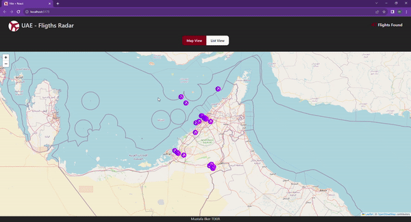

# Flight Radar App

## Screen

## Introduction
Welcome to the Flight Radar App, a real-time flight tracking system that uses RapidAPI services to provide detailed information about flights, including departure and arrival details, images, estimated arrival times, and flight paths displayed on a dynamic map using the Leaflet library. This application is built with a powerful tech stack, including Redux Toolkit, Axios, React, React-Redux, React-Leaflet, and more.

## Features

- **Real-Time Flight Tracking**: Get up-to-the-minute data on flights in the air.
- **Flight Details**: Access comprehensive information on each flight, including departure and arrival times, images of the aircraft, and more.
- **Interactive Map**: Visualize flights on an interactive map powered by the Leaflet library.
- **Pagination**: Navigate through a large number of flights with ease using the React-Paginate component.
- **Responsive Design**: Enjoy a seamless experience on various screen sizes

## RapidAPI Setup

To use the RapidAPI service for flight data, you'll need to sign up for an account and obtain an API key. Follow these steps:

1. Visit RapidAPI and create an account or log in.

2. Search for a suitable flight tracking API.

3. Subscribe to the API and obtain an API key.

4. Copy your API key and add it to the .env file in the project, as mentioned in the Installation section.

## Customization
Feel free to customize and extend this application to suit your specific needs. Some ideas for further development include:

Adding more advanced filtering options.
Implementing historical flight data tracking.
Enhancing the user interface and user experience.